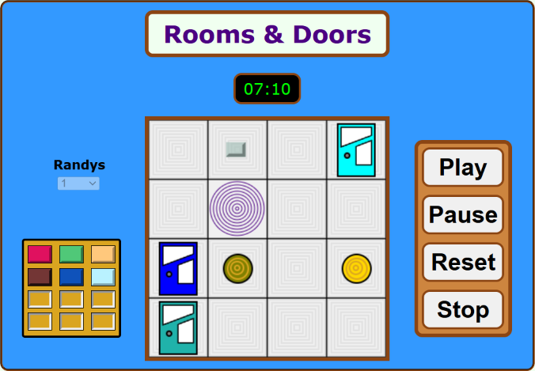

# Rooms & Doors

A browser-based memory game built around random graph traversal — where both you and your AI opponents navigate the same randomly generated maze, but only you know the rules.

🎮 **[Play it live](https://avikpln.github.io/rad/)**



---

## The Game

You start in the first room of a randomly generated maze. Your goal: find and open the final door, hidden somewhere at stage 12. Move between rooms by clicking doors, backtrack through portals, and collect one stone per stage — the final door won't open until you have all 12.

The catch: you're not alone. A configurable number of **random walkers** (0–10) are racing through the same maze simultaneously. They don't need to collect stones — they just need to reach the final door before you do.

---

## Algorithmic Design

The core design question behind this project was: **what graph structure makes a random walk take the longest to reach the exit?**

This is a well-studied problem in the theory of random walks on graphs. The worst-case graph for a random walker — the one that maximizes expected hitting time to the target — is related to structures with bottleneck topologies (such as the lollipop graph). In practice, **random trees** were chosen as the layout for each of the 12 stages, providing a good balance between theoretical difficulty and playable structure: trees have no cycles, so a random walker can easily get "trapped" exploring dead-end branches far from the exit.

Each stage generates a fresh random tree, with rooms as nodes and doors as edges. The competing randys perform true random walks on this structure in real time — meaning the graph layout directly and measurably affects how hard the game is for both you and them.

---

## Origins

This project began as a Python desktop application ([radgame](https://github.com/avikpln/radgame)), where the graph structure and random-walk mechanics were first developed and analyzed. It was later reimagined as a web application using HTML, CSS, and JavaScript, with significant enhancements to gameplay, visuals, and interactivity added along the way.

---

## Tech Stack

- **JavaScript** — game engine, graph generation, random walk simulation
- **HTML / CSS** — UI and responsive layout
- **Graph algorithms** — random tree generation, random walk dynamics

---

## Running Locally

No build step required. Just clone and open:

```bash
git clone https://github.com/avikpln/rad.git
cd rad
open index.html   # or drag into your browser
```

---

## Project Structure

```
rad/
├── css/
│   └── styles.css
├── design/                 # Design assets and UML diagrams
│   ├── game.bmp
│   ├── game.gaphor
│   ├── gui.gaphor
├── images/
│   ├── favicon.ico
│   └── screenshot.png
├── meta/                   # Project metadata
│   ├── academy
│   ├── acknowledgements
│   ├── hierarchy
│   └── version
├── quotes/                 # Quote database
│   ├── JakubPetriska.zip
│   ├── quotes.csv
│   └── quotes.py
├── script/
│   ├── game/               # RAD game logic
│   │   ├── test/           # Game testing utilities
│   │   ├── cell.js
│   │   ├── direction.js
│   │   ├── door.js
│   │   ├── element.js
│   │   ├── game-state.js
│   │   ├── game.js
│   │   ├── location.js
│   │   ├── player.js
│   │   ├── room.js
│   │   └── stone.js
│   ├── gui/                # Graphical user interface
│   ├── library/            # Shared utilities
│   └── main.js
├── sound/                  # Sound effects and voice clips
│   ├── complete.mp3
│   ├── ...
│   └── wow-who-are-you.mp3
├── index.html
├── LICENSE
├── README.md
├── TODO.md
└── zipit.bat
```
